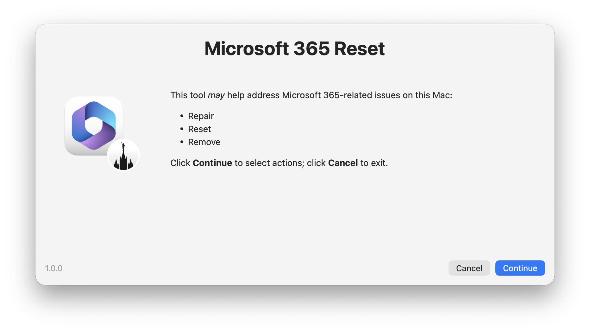
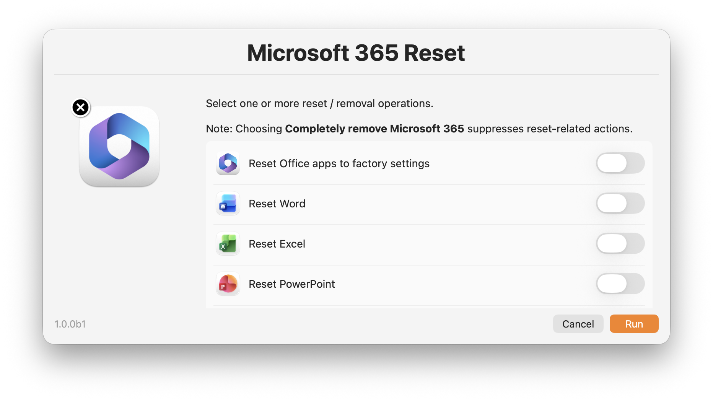
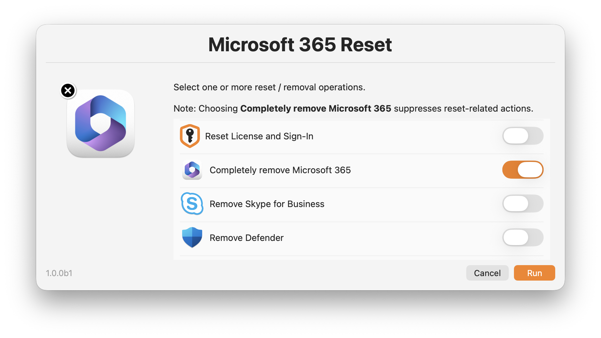
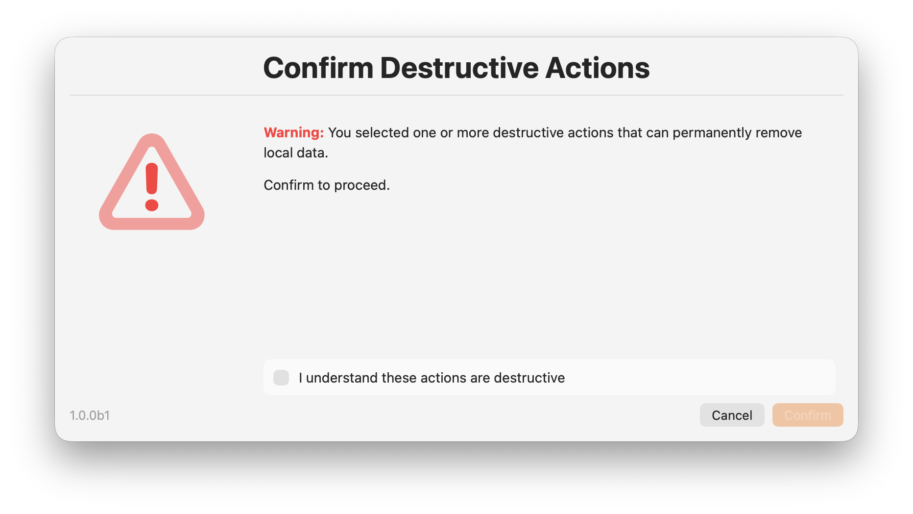
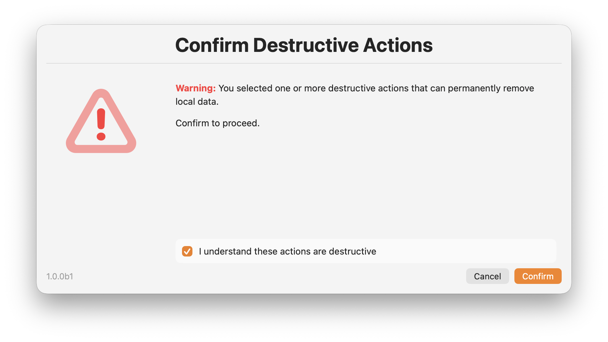
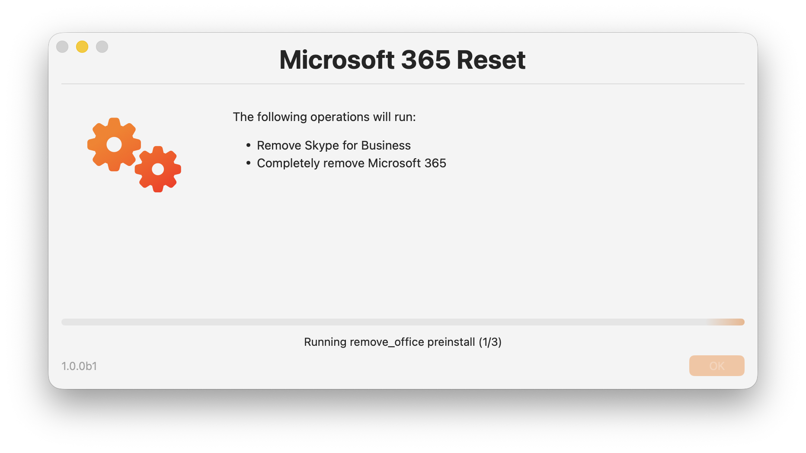

# Microsoft 365 Reset (0.0.1a2)


Unified `zsh` script to repair, reset, or remove Microsoft 365 components on macOS:

- Script: [`Microsoft-365-Reset.zsh`](Microsoft-365-Reset.zsh)
- Release notes: [`CHANGELOG.md`](CHANGELOG.md)
- Original package-era reference: [Microsoft 365 Reset (2.0.0b1) via Jamf Pro Self Service](https://snelson.us/2023/12/microsoft-365-reset-2-0-0/)

## What It Does

The script consolidates expanded package workflows into one root-run tool with:

- Interactive swiftDialog UI in `self-service`, `test`, and `debug` modes
- Non-interactive execution in `silent` mode
- Dependency-aware operation resolution
- Deterministic execution order
- Shared logging and exit codes for automation
- Auto-repair for selected Microsoft apps using Microsoft-hosted packages
- MOFA community-maintained reset script contents adapted into the unified workflow

[MOFA](https://mofa.cocolabs.dev/macos_tools/microsoft_office_repair_tools.html) parity notes:

- `reset_factory` performs its own MOFA-style suite cleanup in addition to dependency expansion
- App repair/reinstall flows for Word, Excel, PowerPoint, Outlook, and OneNote now stop after repair instead of continuing with configuration cleanup in the same run
- `reset_teams` preserves Teams backgrounds, resets Teams TCC state, and opens Screen Recording settings in interactive modes
- `reset_teams` preserves installed Teams app bundles unless repair is required; `reset_teams_force` performs the explicit app removal and reinstall path
- Teams reset and AutoUpdate registration now treat new Teams as the current `TEAMS21` product while keeping classic Teams on the legacy product ID
- Separate `reset_license` and `reset_credentials` operations cover MOFA's split between license-only and broader sign-in reset flows
- `reset_teams_force` provides a force-reinstall path for Teams without adding a new CLI parameter

## Screenshots








## Requirements

- macOS with `zsh`
- Root execution (`sudo` or MDM root context)
- Active non-root console user session (script exits during preflight if none is detected)
- Network access for swiftDialog install/upgrade in interactive modes and Microsoft package download during auto-repair operations
- Built-in tools used by the script (`security`, `defaults`, `pkgutil`, `installer`, `codesign`, `sqlite3`, `nscurl`, etc.)

Important:

- Default log path is `/var/log/org.churchofjesuschrist.log` and requires root.

## Usage

```bash
sudo ./Microsoft-365-Reset.zsh [--mode MODE] [--operations CSV]
```

### Arguments

| Argument | Default | Description |
|---|---|---|
| `--mode` | `self-service` | `self-service`, `silent`, `test`, `debug` |
| `--operations` | empty | Comma-separated operation IDs (primarily for `silent`) |

Checkbox style is hard-coded to `switch,small` in the interactive selection UI.

### Jamf Parameter Mapping

The script also reads Jamf-style parameters:

| Parameter | Meaning |
|---|---|
| `$4` | mode |
| `$5` | operations CSV |

CLI flags override these values when both are present.

## Modes

| Mode | Behavior |
|---|---|
| `self-service` | Full interactive flow (intro, selection, destructive confirmation, progress, completion) |
| `test` | Interactive flow, useful for operator testing |
| `debug` | Interactive flow + `set -x` |
| `silent` | No dialogs; operations must be provided via `--operations`/`$5` |

## Supported Operations

Use these IDs in `--operations` CSV:

| ID | Purpose |
|---|---|
| `reset_factory` | Stop Office/Microsoft services and prime factory reset dependency set |
| `reset_word` | Word app repair checks + Word config/template cleanup |
| `reset_excel` | Excel app repair checks + Excel config/template cleanup |
| `reset_powerpoint` | PowerPoint repair checks + template/theme/add-in cleanup |
| `reset_outlook` | Outlook repair checks + Outlook config/keychain cleanup |
| `remove_outlook_data` | Remove Outlook local mailbox profile/data |
| `reset_onenote` | OneNote repair checks + container/group cleanup |
| `remove_onenote_data` | Remove OneNote cached local data |
| `reset_onedrive` | OneDrive repair checks + cache/container/keychain cleanup |
| `reset_teams` | Teams reset with app validation/repair when needed + Teams cache/container/keychain cleanup |
| `reset_teams_force` | Force-remove and reinstall Teams, then perform Teams cache/container/keychain cleanup |
| `reset_autoupdate` | Reset MAU prefs/cache and reinstall/update MAU when applicable |
| `reset_license` | Reset Office licensing files and core Office identity data |
| `reset_credentials` | Remove Office licensing/sign-in artifacts and token/keychain data |
| `remove_office` | Full Microsoft 365 removal workflow |
| `remove_skypeforbusiness` | Remove Skype for Business app/data/keychain entries |
| `remove_defender` | Remove Microsoft Defender app/data/receipts |
| `remove_zoomplugin` | Remove Zoom Outlook plugin and related metadata |
| `remove_webexpt` | Remove WebEx Productivity Tools and related metadata |

## Dependency Rules

The script enforces package-equivalent dependencies:

- Selecting `reset_factory` auto-adds `reset_word`, `reset_excel`, `reset_powerpoint`, `reset_outlook`, `reset_onenote`, `reset_onedrive`, `reset_teams`, `reset_autoupdate`, and `reset_credentials`
- Selecting `reset_credentials` suppresses `reset_license`
- Selecting `reset_teams_force` suppresses `reset_teams`
- Selecting `remove_office` auto-adds `remove_skypeforbusiness`
- Selecting `remove_office` suppresses reset-family selections

## Destructive Safeguards

In interactive modes, a second confirmation dialog is required when any of these are selected:

- `remove_office`
- `remove_outlook_data`
- `remove_onenote_data`

If confirmation is cancelled or not acknowledged, script exits with code `2`.

## Execution Order

After dependency resolution, operations run in deterministic phases:

1. Reset operations (`reset_*`)
2. Data-removal operations (`remove_outlook_data`, `remove_onenote_data`)
3. Ancillary removals (`remove_defender`, `remove_zoomplugin`, `remove_webexpt`, `remove_skypeforbusiness`)
4. Full remove (`remove_office`)

If `remove_office` is selected, its preinstall-style teardown phase runs before the operation loop.

## Auto-Repair Behavior

The following operations include app repair checks and may download/reinstall from Microsoft URLs:

- `reset_word`
- `reset_excel`
- `reset_powerpoint`
- `reset_outlook`
- `reset_onenote`
- `reset_onedrive`
- `reset_teams`
- `reset_teams_force`
- `reset_autoupdate`

Repair pipeline includes:

- URL resolution
- download
- content-length sanity check
- Microsoft signature verification
- `installer -pkg ... -target /`

## Examples

Interactive (default):

```bash
sudo ./Microsoft-365-Reset.zsh
```

Silent run with explicit operations:

```bash
sudo ./Microsoft-365-Reset.zsh \
  --mode silent \
  --operations reset_outlook,reset_credentials
```

Local dry invocation for parser checks (will fail root preflight by design):

```bash
./Microsoft-365-Reset.zsh --mode silent --operations reset_factory
```

Jamf-style invocation example:

```bash
sudo ./Microsoft-365-Reset.zsh "" "" "" "silent" "reset_autoupdate,reset_credentials"
```

## Exit Codes

| Code | Meaning |
|---|---|
| `0` | Success |
| `2` | User cancelled or no operations provided in `silent` mode |
| `10` | Preflight/validation failure |
| `20` | One or more operations failed |

## Validation

Syntax check:

```bash
zsh -n ./Microsoft-365-Reset.zsh
```

## Safety Notes

- This script performs destructive actions when requested.
- `remove_office`, `remove_outlook_data`, and `remove_onenote_data` can permanently remove local data.
- Test in a lab/VM before broad deployment.
