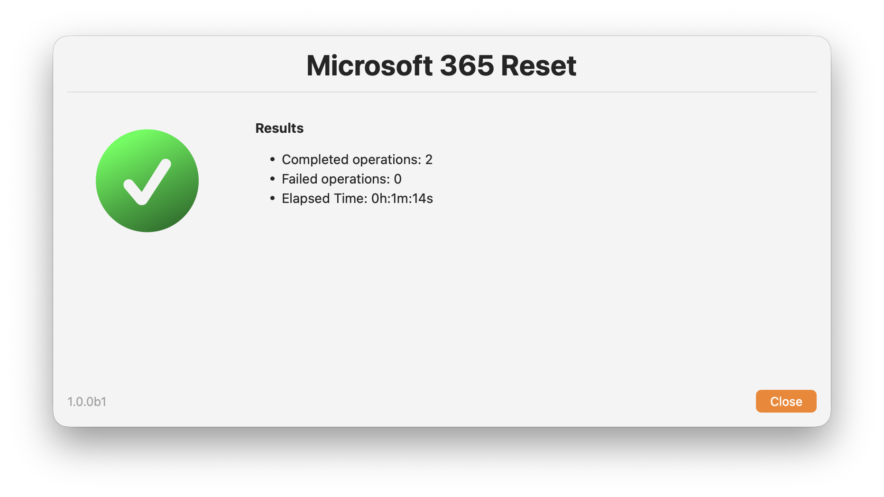

    

# Microsoft 365 Reset (1.0.0b3)


Unified `zsh` script to repair, reset, or remove Microsoft 365 components on macOS:

- Script: [`Microsoft-365-Reset.zsh`](Microsoft-365-Reset.zsh)
- Release notes: [`CHANGELOG.md`](CHANGELOG.md)
- Original package-era reference: [Microsoft 365 Reset (2.0.0b1) via Jamf Pro Self Service](https://snelson.us/2023/12/microsoft-365-reset-2-0-0/)

## What It Does

The script consolidates expanded package workflows into one root-run tool with:

- Interactive swiftDialog UI in `self-service`, `test`, and `debug` modes
- Non-interactive execution in `silent` mode
- Dependency-aware operation resolution
- Deterministic execution order
- Shared logging and exit codes for automation
- Auto-repair for selected Microsoft apps using Microsoft-hosted packages
- MOFA community-maintained reset script contents adapted into the unified workflow

[MOFA](https://mofa.cocolabs.dev/macos_tools/microsoft_office_repair_tools.html) alignment and intentional divergence notes:

- `reset_factory` performs its own MOFA-style suite cleanup in addition to dependency expansion
- App repair/reinstall flows for Word, Excel, PowerPoint, Outlook, and OneNote now stop after repair instead of continuing with configuration cleanup in the same run
- `reset_teams` preserves Teams backgrounds, resets Teams TCC state, and opens Screen Recording settings in interactive modes
- `reset_teams` preserves installed Teams app bundles unless repair is required; `reset_teams_force` performs the explicit app removal and reinstall path
- Teams reset and AutoUpdate registration now treat new Teams as the current `TEAMS21` product while keeping classic Teams on the legacy product ID
- Separate `reset_license` and `reset_credentials` operations cover MOFA's split between license-only and broader sign-in reset flows
- `reset_teams_force` provides a force-reinstall path for Teams without adding a new CLI parameter

## Screenshots

<table>
  <tr>
    <td></td>
    <td></td>
    <td></td>
  </tr>
  <tr>
    <td></td>
    <td></td>
    <td></td>
  </tr>
  <tr>
    <td></td>
    <td></td>
    <td></td>
  </tr>
</table>

## Requirements

- macOS with `zsh`
- Root execution (`sudo` or MDM root context)
- Active non-root console user session (script exits during preflight if none is detected)
- Network access for swiftDialog install/upgrade in interactive modes and Microsoft package download during auto-repair operations
- Built-in tools used by the script (`security`, `defaults`, `pkgutil`, `installer`, `codesign`, `sqlite3`, `nscurl`, etc.)

Important:

- Default log path is `/var/log/org.churchofjesuschrist.log` and requires root.

## Usage

```bash
sudo ./Microsoft-365-Reset.zsh [--mode MODE] [--operations CSV]
```

### Arguments

| Argument | Default | Description |
|---|---|---|
| `--mode` | `self-service` | `self-service`, `silent`, `test`, `debug` |
| `--operations` | empty | Comma-separated operation IDs (primarily for `silent`) |

Checkbox style is hard-coded to `switch,large` in the interactive selection UI, and each option includes its own operation icon.

### Jamf Parameter Mapping

The script also reads Jamf-style parameters:

| Parameter | Meaning |
|---|---|
| `$4` | mode |
| `$5` | operations CSV |

CLI flags (`--mode`, `--operations`) override these values when both are present. The parser tolerates up to five leading positional arguments for Jamf-style execution before the first CLI flag, which covers Jamf's `$1-$3` placeholders plus `$4`/`$5`. Unexpected bare positional arguments after a CLI flag still fail validation.

## Modes

| Mode | Behavior |
|---|---|
| `self-service` | Full interactive flow (intro, selection, destructive confirmation, resolved-operation progress summary, completion) |
| `test` | Interactive flow, useful for operator testing |
| `debug` | Interactive flow + `set -x` |
| `silent` | No dialogs; operations must be provided via `--operations`/`$5` |

## Supported Operations

Use these IDs in `--operations` CSV:

| ID | Purpose |
|---|---|
| `reset_factory` | Stop Office/Microsoft services and prime factory reset dependency set |
| `reset_word` | Word app repair checks + Word config/template cleanup |
| `reset_excel` | Excel app repair checks + Excel config/template cleanup |
| `reset_powerpoint` | PowerPoint repair checks + template/theme/add-in cleanup |
| `reset_outlook` | Outlook repair checks + Outlook config/keychain cleanup |
| `remove_outlook_data` | Remove Outlook local mailbox profile/data |
| `reset_onenote` | OneNote repair checks + container/group cleanup |
| `remove_onenote_data` | Remove OneNote cached local data |
| `reset_onedrive` | OneDrive repair checks + cache/container/keychain cleanup |
| `reset_teams` | Teams reset with app validation/repair when needed + Teams cache/container/keychain cleanup |
| `reset_teams_force` | Force-remove and reinstall Teams, then perform Teams cache/container/keychain cleanup |
| `reset_autoupdate` | Reset MAU prefs/cache and reinstall/update MAU when applicable |
| `reset_license` | Reset Office licensing files and core Office identity data |
| `reset_credentials` | Remove Office licensing/sign-in artifacts and token/keychain data |
| `remove_office` | Full Microsoft 365 removal workflow |
| `remove_skypeforbusiness` | Remove Skype for Business app/data/keychain entries |
| `remove_defender` | Remove Microsoft Defender app/data/receipts |
| `remove_acrobat_addin` | Remove Adobe Acrobat add-in payloads from Word, Excel, and PowerPoint startup folders in both system and user Office content paths |
| `remove_zoomplugin` | Remove Zoom Outlook plugin and related metadata |
| `remove_webexpt` | Remove WebEx Productivity Tools and related metadata |

## Dependency Rules

The script enforces package-equivalent dependencies:

- Selecting `reset_factory` auto-adds `reset_word`, `reset_excel`, `reset_powerpoint`, `reset_outlook`, `reset_onenote`, `reset_onedrive`, `reset_teams`, `reset_autoupdate`, and `reset_credentials`
- Selecting `reset_credentials` suppresses `reset_license`
- Selecting `reset_teams_force` suppresses `reset_teams`
- `remove_acrobat_addin` runs as a standalone operation with no dependency expansion or suppression
- `remove_acrobat_addin` waits for Word, Excel, PowerPoint, and Acrobat to quit in interactive modes; `silent` mode force-stops those apps before cleanup
- Selecting `remove_office` auto-adds `remove_skypeforbusiness`
- Selecting `remove_office` suppresses reset-family selections

### Acrobat Add-in Removal

`remove_acrobat_addin` removes the Adobe Acrobat startup payloads used by the Office apps:

- `AcrobatExcelAddin.xlam`
- `linkCreation.dotm`
- `SaveAsAdobePDF.ppam`

The script checks both supported Office content roots:

- `/Library/Application Support/Microsoft/Office365/User Content.localized`
- `~/Library/Group Containers/UBF8T346G9.Office/User Content.localized`

Within each root, cleanup covers both `Startup` and `Startup.localized`, and both `Powerpoint` and `PowerPoint` folder name variants where applicable.

## Destructive Safeguards

In interactive modes, a second confirmation dialog is required when any of these are selected:

- `remove_office`
- `remove_outlook_data`
- `remove_onenote_data`

If the user cancels this confirmation dialog, the script exits cleanly with code `0`. If the confirmation payload is not acknowledged, the script exits with code `2`.

## Execution Order

After dependency resolution, operations run in deterministic phases:

1. Reset operations (`reset_*`)
2. Data-removal operations (`remove_outlook_data`, `remove_onenote_data`)
3. Ancillary removals (`remove_defender`, `remove_acrobat_addin`, `remove_zoomplugin`, `remove_webexpt`, `remove_skypeforbusiness`)
4. Full remove (`remove_office`)

If `remove_office` is selected, its preinstall-style teardown phase runs before the operation loop.

## Auto-Repair Behavior

The following operations include app repair checks and may download/reinstall from Microsoft URLs:

- `reset_word`
- `reset_excel`
- `reset_powerpoint`
- `reset_outlook`
- `reset_onenote`
- `reset_onedrive`
- `reset_teams`
- `reset_teams_force`
- `reset_autoupdate`

Repair pipeline includes:

- URL resolution
- download
- content-length sanity check
- Microsoft signature verification
- `installer -pkg ... -target /`

## Examples

Interactive (default):

```bash
sudo ./Microsoft-365-Reset.zsh
```

Silent run with explicit operations:

```bash
sudo ./Microsoft-365-Reset.zsh \
  --mode silent \
  --operations reset_outlook,reset_credentials
```

Silent run to remove only the Adobe Acrobat add-in payloads:

```bash
sudo ./Microsoft-365-Reset.zsh \
  --mode silent \
  --operations remove_acrobat_addin
```

Local dry invocation for parser checks (will fail root preflight by design):

```bash
./Microsoft-365-Reset.zsh --mode silent --operations reset_factory
```

Jamf-style invocation example:

```bash
sudo ./Microsoft-365-Reset.zsh "" "" "" "silent" "reset_autoupdate,reset_credentials"
```

Jamf-style invocation with CLI override example:

```bash
sudo ./Microsoft-365-Reset.zsh "" "" "" "self-service" "" --mode silent --operations reset_autoupdate,reset_credentials
```

## Maintainer MOFA Workflow

For repo maintenance, `scripts/mofa-consult.zsh` can sync a sibling `../MOFA` checkout from upstream MOFA and generate a focused inclusion report for this repo. This helper is not used by `Microsoft-365-Reset.zsh` at runtime.

MOFA is the primary behavior baseline for this repo. Use the package-era reference as secondary context for retained chooser logic, dependency history, and operations that do not have a current MOFA community-script equivalent. If this repo intentionally keeps package-era behavior instead of MOFA behavior, treat that as a documented divergence that needs a defensible reason.

By default, the sync step fast-forwards the sibling MOFA checkout's local `main` branch to `upstream/main` and pushes `origin/main` to keep your fork current. Use `--no-push-origin` to skip the fork push.

Default sync + report:

```bash
./scripts/mofa-consult.zsh
```

After any report-generating run, the helper prints a ready-to-paste Codex prompt for reviewing the generated report in this repo context and copies that prompt to the clipboard when `pbcopy` is available.

The package-era comparison is optional. When `Resources/Microsoft_Office_Reset_2.0.0b1_expanded/Distribution` is available locally, the report compares retained package-era operations against the unified workflow. When that local reference is absent, the helper warns and marks the package-era section as `Skipped` instead of failing the full report.

Generate a report from the current local MOFA checkout without syncing:

```bash
./scripts/mofa-consult.zsh --report-only --mofa-repo ../MOFA --output /var/tmp/M365R-MOFA-report.md
```

Sync local `main` from `upstream/main` without pushing your fork:

```bash
./scripts/mofa-consult.zsh --sync-only --no-push-origin
```

The report uses `Covered`, `Candidate inclusion`, `Intentional divergence`, `Local-only operation`, and `Skipped` classifications, and compares:

- MOFA community-maintained reset scripts against local operation coverage
- Package-era Distribution choices retained in the unified workflow even when there is no current MOFA community-script mapping, when the local expanded package reference is available
- MOFA stable feed metadata from `latest_raw_files/macos_standalone_latest.json`
- Hard-coded local repair links, MAU application IDs, and current minimum-version thresholds for Teams and MAU
- Resolved `file://` links back to the sibling MOFA scripts referenced by the report

## Exit Codes

| Code | Meaning |
|---|---|
| `0` | Success, including intentional user cancellation in interactive modes |
| `2` | No operations provided in `silent` mode or destructive confirmation was not acknowledged |
| `10` | Preflight/validation failure |
| `20` | One or more operations failed |

## Validation

Syntax check:

```bash
zsh -n ./Microsoft-365-Reset.zsh
```

## Safety Notes

- This script performs destructive actions when requested.
- `remove_office`, `remove_outlook_data`, and `remove_onenote_data` can permanently remove local data.
- Test in a lab/VM before broad deployment.
